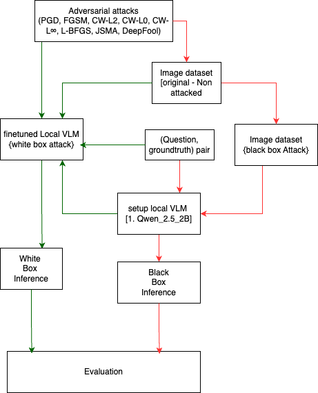

# Evaluating Nano Vision-Language Models' (VLMs) Robustness Against Cyber Security Attacks: White-Box (Finetuning) and Black-Box (Inference) Scenarios

This repository contains tools for evaluating small (4-bit, 3 Billion parameter) vision-language models (VLMs) under various multi-modal adversarial attacks, focusing on their robustness and performance degradation.

## Overview

This evaluation framework includes:
- Testing infrastructure for lightweight VLMs (4-bit quantized, ~3B parameters)
- Multi-modal adversarial attack implementations to test model robustness
- Performance benchmarking on visual reasoning tasks under attack conditions
- Comparative analysis between original and adversarially perturbed inputs
- Evaluation across diverse visual content including charts, tables, and maps


*Framework for evaluating VLM robustness against adversarial attacks, showing both white-box (green path) and black-box (red path) attack scenarios.*

### Adversarial Attack Variants

Each attack variant has its own strengths and characteristics:

- **Projected Gradient Descent (PGD)**: An iterative attack that takes multiple small steps in the direction of the gradient and projects the perturbation back onto an epsilon-ball after each step. PGD creates stronger adversarial examples than single-step methods by exploring the loss landscape more thoroughly while maintaining a constraint on the maximum perturbation.

- **Fast Gradient Sign Method (FGSM)**: A single-step attack that generates adversarial examples by taking a step in the direction of the sign of the gradient of the loss function with respect to the input. FGSM is computationally efficient but typically produces less effective adversarial examples compared to iterative methods.

- **Carlini-Wagner L2 (CW-L2)**: Produces visually imperceptible perturbations with minimal overall distortion by optimizing for the L2 (Euclidean) distance between original and adversarial images. This variant typically creates high-quality adversarial examples that are difficult to detect visually.

- **Carlini-Wagner L0 (CW-L0)**: Changes the fewest pixels but may make more noticeable changes to those pixels. This variant focuses on minimizing the number of modified pixels rather than the magnitude of changes, resulting in sparse but potentially more visible perturbations.

- **Carlini-Wagner L∞ (CW-L∞)**: Distributes changes evenly across the image, limiting the maximum change to any pixel. This variant ensures that no single pixel is modified beyond a certain threshold, creating perturbations that are bounded in their maximum intensity.

- **Limited-memory BFGS (L-BFGS)**: One of the first methods for generating adversarial examples, L-BFGS aims to find an adversarial example that is visually similar to the original image while causing misclassification. It formulates this as an optimization problem that minimizes the L2 distance between images subject to a misclassification constraint.

- **Jacobian-based Saliency Map Attack (JSMA)**: Optimized for the L0 distance metric, JSMA aims to modify the fewest possible pixels while causing misclassification. It uses a saliency map to identify the most influential pixels for classification and iteratively modifies them to achieve the target class.

- **DeepFool**: Designed to find the minimal perturbation needed to cause misclassification, DeepFool works by iteratively finding the closest decision boundary to the input sample and then pushing the sample across that boundary. It typically produces smaller perturbations than FGSM while being more computationally efficient than optimization-based methods.

## Setup

1. Clone the repository
2. Create a virtual environment:
   ```bash
   python -m venv venv_MM
   source venv_MM/bin/activate
   pip install -r requirements.txt
   ```
3. Create a `.env` file in the root directory with your OpenAI API key:
   ```
   OPENAI_API_KEY=your_api_key_here
   ```

Note: The evaluation scripts automatically download required NLTK resources (like WordNet) when needed.

## Evaluation Pipeline

The evaluation pipeline consists of two main scripts and multiple attack implementations:

### Evaluation Scripts

#### 1. `eval_model.py`

Generates evaluation results for a specific model on a specific task.

```bash
cd scripts
python eval_model.py
```

- Interactive engine selection (GPT-4o or Qwen25_VL_3B or ALL)
- Interactive attack type selection
- Fixed task ('chart') and sample count (17)
- Results saved to `results/{engine}/eval_{engine}_{task}_{random_count}.json`
- Can be configured to use original or adversarial images

#### 2. `eval_vqa.py`

Analyzes evaluation results and calculates accuracy metrics.

```bash
cd scripts
python eval_vqa.py
```

- Interactive engine selection
- Fixed task ('chart')
- Automatically finds and evaluates all result files
- Shows accuracy comparison and changes due to different attack types

### Attack Implementations

| Attack | Script | Approach | Parameters | Output Directory |
|--------|--------|----------|------------|-----------------|
| **PGD** | `v2_pgd_attack.py` | Multi-step with projection | `--eps`, `--eps_step`, `--max_iter` | `test_extracted_adv/` |
| **FGSM** | `v3_fgsm_attack.py` | Single-step gradient sign | `--eps`, `--targeted`, `--target_class` | `test_extracted_adv_fgsm/` |
| **CW-L2** | `v4_cw_l2_attack.py` | Optimization for L2 norm | `--confidence`, `--max_iter`, `--learning_rate` | `test_extracted_adv_cw_l2/` |
| **CW-L0** | `v5_cw_l0_attack.py` | Optimization for pixel count | `--confidence`, `--max_iter` | `test_extracted_adv_cw_l0/` |
| **CW-L∞** | `v6_cw_linf_attack.py` | Optimization for max perturbation | `--confidence`, `--binary_steps` | `test_extracted_adv_cw_linf/` |
| **L-BFGS** | `v7_lbfgs_attack.py` | Box-constrained optimization | `--target_class`, `--c_init`, `--max_iter` | `test_extracted_adv_lbfgs/` |
| **JSMA** | `v8_jsma_attack.py` | Saliency mapping | `--target_class`, `--max_iter`, `--theta`, `--use_logits` | `test_extracted_adv_jsma/` |
| **DeepFool** | `v9_deepfool_attack.py` | Iterative linear approximation | `--max_iter`, `--overshoot` | `test_extracted_adv_deepfool/` |

All attacks use a "black-box transfer attack" strategy with a pre-trained ResNet50 as a substitute model, since most VLMs don't provide gradient access needed for direct attacks.

## Workflow and Usage

### Complete Evaluation Workflow

1. **Generate adversarial images** using one or more attack methods:
   ```bash
   # PGD attack
   python attack_models/black_box_attacks/v2_pgd_attack.py --image_path data/test_extracted/chart/image.png --eps 0.03
   
   # FGSM attack
   python attack_models/black_box_attacks/v3_fgsm_attack.py --image_path data/test_extracted/chart/image.png --eps 0.03
   
   # CW-L2 attack
   python attack_models/black_box_attacks/v4_cw_l2_attack.py --image_path data/test_extracted/chart/image.png --confidence 5 --max_iter 100
   
   # CW-L0 attack
   python attack_models/black_box_attacks/v5_cw_l0_attack.py --image_path data/test_extracted/chart/image.png --max_iter 50 --confidence 10
   
   # CW-L∞ attack
   python attack_models/black_box_attacks/v6_cw_linf_attack.py --image_path data/test_extracted/chart/image.png --confidence 5 --binary_steps 10
   
   # L-BFGS attack
   python attack_models/black_box_attacks/v7_lbfgs_attack.py --image_path data/test_extracted/chart/image.png --target_class 20 --c_init 0.1 --max_iter 10
   
   # JSMA attack
   python attack_models/black_box_attacks/v8_jsma_attack.py --image_path data/test_extracted/chart/image.png --target_class 20 --max_iter 100 --theta 1.0
   
   # DeepFool attack
   python attack_models/black_box_attacks/v9_deepfool_attack.py --image_path data/test_extracted/chart/image.png --max_iter 50 --overshoot 0.02
   ```

2. **Run evaluation** on original and adversarial images:
   ```bash
   python scripts/eval_model.py
   # Follow the interactive prompts to select the model and attack type
   ```

3. **Compare results**:
   ```bash
   python scripts/eval_vqa.py
   # Follow the interactive prompts to select the model
   ```

## Directory Structure

```
Multi-modal-Self-instruct/
├── attack_models/          # Adversarial attack scripts
│   └── black_box_attacks/  # Black-box attack implementations
│       ├── v0_attack_utils.py      # Utility functions for attacks
│       ├── v2_pgd_attack.py        # PGD attack implementation
│       ├── v3_fgsm_attack.py       # FGSM attack implementation
│       ├── v4_cw_l2_attack.py      # CW-L2 attack implementation
│       ├── v5_cw_l0_attack.py      # CW-L0 attack implementation
│       ├── v6_cw_linf_attack.py    # CW-L∞ attack implementation
│       ├── v7_lbfgs_attack.py      # L-BFGS attack implementation
│       ├── v8_jsma_attack.py       # JSMA attack implementation
│       └── v9_deepfool_attack.py   # DeepFool attack implementation
├── data/                   # Dataset files
│   ├── test_extracted/        # Original test images
│   ├── test_extracted_adv/    # PGD adversarial images
│   ├── test_extracted_adv_fgsm/ # FGSM adversarial images
│   ├── test_extracted_adv_cw_l2/ # CW-L2 adversarial images
│   ├── test_extracted_adv_cw_l0/ # CW-L0 adversarial images
│   ├── test_extracted_adv_cw_linf/ # CW-L∞ adversarial images
│   ├── test_extracted_adv_lbfgs/ # L-BFGS adversarial images
│   ├── test_extracted_adv_jsma/ # JSMA adversarial images
│   └── test_extracted_adv_deepfool/ # DeepFool adversarial images
├── results/                # Evaluation results
│   ├── gpt4o/              # GPT-4o results
│   └── Qwen25_VL_3B/       # Qwen results
├── scripts/                # Evaluation scripts
│   ├── eval_model.py       # Script to generate model responses
│   ├── eval_vqa.py         # Script to calculate accuracy metrics
│   ├── select_attack.py    # Script for attack selection
│   ├── llm_tools.py        # Utilities for OpenAI API calls
│   └── local_llm_tools.py  # Utilities for local model inference
└── unit_test/              # Test scripts
```

## Adversarial Robustness Results

Testing shows interesting differences in model robustness against different attack types:

### Comprehensive Results Table

#### GPT-4o
| Attack | Accuracy | Change | Effect |
|--------|----------|--------|--------|
| Original | 64.71% | 0.00% | Baseline |
| CW-L0 | 58.82% | -5.88% | Degradation |
| FGSM | 64.71% | 0.00% | No Change |
| PGD | 70.59% | +5.88% | Improvement |
| JSMA | 70.59% | +5.88% | Improvement |
| CW-L2 | 76.47% | +11.76% | Improvement |
| CW-L∞ | 82.35% | +17.65% | Improvement |
| L-BFGS | 82.35% | +17.65% | Improvement |
| DeepFool | 82.35% | +17.65% | Improvement |

#### Qwen25_VL_3B
| Attack | Accuracy | Change | Effect |
|--------|----------|--------|--------|
| Original | 82.35% | 0.00% | Baseline |
| CW-L0 | 11.76% | -70.59% | Degradation |
| PGD | 35.29% | -47.06% | Degradation |
| CW-L2 | 35.29% | -47.06% | Degradation |
| CW-L∞ | 35.29% | -47.06% | Degradation |
| L-BFGS | 35.29% | -47.06% | Degradation |
| JSMA | 35.29% | -47.06% | Degradation |
| FGSM | 41.18% | -41.18% | Degradation |
| DeepFool | 47.06% | -35.29% | Degradation |

### Key Insights

- **Contrasting Robustness Profiles**: While Qwen25_VL_3B outperforms GPT-4o on clean images (82.35% vs 64.71%), GPT-4o demonstrates exceptional robustness to adversarial attacks, with performance actually improving under most attack conditions.

- **Unexpected Performance Enhancement**: Most notably, GPT-4o's performance improves significantly with CW-L∞, L-BFGS, and DeepFool attacks (+17.65%), suggesting advanced adversarial training or architectural innovations in GPT-4o.

- **Attack Effectiveness Patterns**: 
  - For GPT-4o: CW-L∞ = L-BFGS = DeepFool > CW-L2 > PGD = JSMA > FGSM = Original > CW-L0
  - For Qwen25_VL_3B: Original > DeepFool > FGSM > PGD = CW-L2 = CW-L∞ = L-BFGS = JSMA > CW-L0

- **Differential Impact of CW-L0**: The CW-L0 attack is the only attack that consistently degrades GPT-4o's performance (-5.88%) and is also the most effective against Qwen25_VL_3B (-70.59%). This suggests that sparse but significant pixel changes are particularly challenging for both models.

- **DeepFool Effectiveness**: DeepFool is the least effective attack against Qwen25_VL_3B (-35.29%), despite being one of the most effective at improving GPT-4o's performance. This highlights the different vulnerability profiles of these models.

- **L0 vs L2/L∞ Attacks**: Attacks that optimize for L0 norm (minimizing the number of modified pixels) seem to be more effective at degrading performance, while attacks that optimize for L2 or L∞ norms (minimizing the overall distortion) can actually improve performance for robust models like GPT-4o.

- **Implications for VLM Design**: These findings challenge conventional wisdom about adversarial attacks and suggest that certain architectural choices or training techniques may not only provide robustness but actually enhance performance under attack conditions.

## Recent Progress and Future Work

### Recent Improvements
- Added eight complementary attack implementations (PGD, FGSM, CW-L2, CW-L0, CW-L∞, L-BFGS, JSMA, DeepFool) for comprehensive robustness testing
- Enhanced evaluation scripts with interactive model and attack selection
- Improved accuracy reporting to clearly indicate improvements vs. degradations
- Streamlined workflow for testing multiple attack types against different models
- Added detailed documentation for each attack method with mathematical formulations

### Future Directions
- Implement white-box attacks for models where architecture and gradients are accessible
- Evaluate finetuned models under adversarial conditions to measure robustness improvements
- Compare effectiveness of adversarial training techniques in improving VLM robustness
- Explore multi-modal adversarial attacks that target both vision and language components
- Investigate the reasons behind GPT-4o's improved performance under certain adversarial conditions
