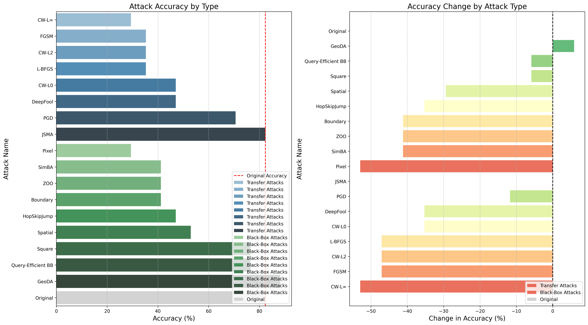

# Evaluating Nano Vision-Language Models' (VLMs) Robustness Against Cyber Security Attacks

This repository contains tools for evaluating small (4-bit, 3 Billion parameter) vision-language models (VLMs) under various multi-modal adversarial attacks, focusing on their robustness and performance degradation.

## System Design

The evaluation framework consists of four main modules:

### 1. VLM Inference Engine
Located in `local_model/`, this module handles model loading, quantization, and inference:
- `model_classes.py`: Factory pattern for creating model instances
- `qwen_model.py`: QwenVLModelWrapper for Qwen2.5-VL-3B-Instruct
- Future models: GuardReasoner-VL-Eco-3B, NQLSG-Qwen2-VL-2B-v2-Base

The model loading path follows:
```
scripts/eval_model.py
   ↓
scripts/local_llm_tools.py
   ↓
local_model/model_classes.py → create_model()
   ↓
local_model/qwen_model.py → QwenVLModelWrapper
```

### 2. Transfer Attacks
Located in `attack_models/transfer_attacks/`, these attacks typically require access to model gradients but are implemented here using surrogate models:
- `v2_pgd_attack.py`: Projected Gradient Descent attack
- `v3_fgsm_attack.py`: Fast Gradient Sign Method attack
- `v4_cw_l2_attack.py`: Carlini & Wagner L2 attack
- `v5_cw_l0_attack.py`: Carlini & Wagner L0 attack
- `v6_cw_linf_attack.py`: Carlini & Wagner L∞ attack
- `v7_lbfgs_attack.py`: L-BFGS attack
- `v8_jsma_attack.py`: Jacobian-based Saliency Map Attack
- `v9_deepfool_attack.py`: DeepFool attack

### 3. True Black-Box Attacks
Located in `attack_models/true_black_box_attacks/`, these attacks don't require any gradient information:
- `v10_square_attack.py`: Square Attack with perceptual constraints
- `v11_hop_skip_jump_attack.py`: HopSkipJump Attack with perceptual constraints
- `v12_pixel_attack.py`: Pixel Attack with perceptual constraints
- `v13_simba_attack.py`: SimBA (Simple Black-box Adversarial) Attack with perceptual constraints
- `v14_spatial_transformation_attack.py`: Spatial Transformation Attack with perceptual constraints
- `v15_query_efficient_bb_attack.py`: Query-Efficient Black-box Attack with perceptual constraints
- `v0_attack_utils.py`: Shared utility functions for all black-box attacks

### 4. Evaluation Framework
Located in `scripts/`, this module handles model evaluation and result analysis:
- `eval_model.py`: Generates model responses for specific tasks
- `eval_vqa.py`: Analyzes results and calculates accuracy metrics
- `select_attack.py`: Handles attack selection and configuration

## Attack Workflow

```
┌─────────────────────────────────────────────────────────────────────┐
│                   ADVERSARIAL ATTACK WORKFLOW                       │
└─────────────────────────────────────────────────────────────────────┘

┌─────────────────────────────┐
│ STEP 1: GENERATE ADVERSARIAL│
│         EXAMPLES           │
└───────────────┬─────────────┘
                │
                ▼
┌─────────────────────────────────────────────────────────────────────┐
│ attack_models/[attack_type]/[attack_script].py                      │
│                                                                     │
│ ┌───────────────┐    ┌───────────────┐    ┌───────────────────────┐ │
│ │ Load Original │ → │ Apply Attack   │ → │ Apply Perceptual      │ │
│ │ Image         │    │ Algorithm     │    │ Constraints           │ │
│ └───────────────┘    └───────────────┘    └───────────────────────┘ │
└─────────────────────────────┬───────────────────────────────────────┘
                              │
                              ▼
┌─────────────────────────────────────────────────────────────────────┐
│ OUTPUT: data/test_BB_[attack]/chart/[image_name].png                │
└─────────────────────────────┬───────────────────────────────────────┘
                              │
                              ▼
┌─────────────────────────────────────────────────────────────────────┐
│ STEP 2: EVALUATE MODEL ON   │
│         ADVERSARIAL IMAGES  │
└───────────────┬─────────────┘
                │
                ▼
┌─────────────────────────────────────────────────────────────────────┐
│ scripts/eval_model.py                                               │
│                                                                     │
│ ┌───────────────┐    ┌───────────────┐    ┌───────────────────────┐ │
│ │ Select Model  │ → │ Load Images    │ → │ Generate Predictions   │ │
│ │ (Qwen25_VL_3B)│    │ (Adversarial) │    │ for Each Image        │ │
│ └───────────────┘    └───────────────┘    └───────────────────────┘ │
│                                                                     │
│ Model Loading Path:                                                 │
│ scripts/eval_model.py                                               │
│    ↓                                                                │
│ scripts/local_llm_tools.py                                          │
│    ↓                                                                │
│ local_model/model_classes.py → create_model()                       │
│    ↓                                                                │
│ local_model/qwen_model.py → QwenVLModelWrapper                      │
└─────────────────────────────┬───────────────────────────────────────┘
                              │
                              ▼
┌─────────────────────────────────────────────────────────────────────┐
│ OUTPUT: results/Qwen25_VL_3B/eval_Qwen25_VL_3B_chart_17_BB_[attack].json │
└─────────────────────────────┬───────────────────────────────────────┘
                              │
                              ▼
┌─────────────────────────────────────────────────────────────────────┐
│ STEP 3: CALCULATE ACCURACY  │
│         METRICS            │
└───────────────┬─────────────┘
                │
                ▼
┌─────────────────────────────────────────────────────────────────────┐
│ scripts/eval_vqa.py                                                 │
│                                                                     │
│ ┌───────────────┐    ┌───────────────┐    ┌───────────────────────┐ │
│ │ Load Results  │ → │ Calculate      │ → │ Display Accuracy       │ │
│ │ JSON Files    │    │ Accuracy      │    │ Comparison            │ │
│ └───────────────┘    └───────────────┘    └───────────────────────┘ │
└─────────────────────────────────────────────────────────────────────┘
```

## Execution Commands

### 1. Setup

```bash
python -m venv venv_MM
source venv_MM/bin/activate
pip install -r requirements.txt
```

### 2. Generate Adversarial Examples

#### Square Attack (True Black-Box)
```bash
source venv_MM/bin/activate && python attack_models/true_black_box_attacks/v10_square_attack.py --image_path data/test_extracted/chart/20231114102825506748.png --eps 0.15 --norm inf --max_iter 200 --p_init 0.3 --ssim_threshold 0.85
```

#### HopSkipJump Attack (True Black-Box)
```bash
source venv_MM/bin/activate && python attack_models/true_black_box_attacks/v11_hop_skip_jump_attack.py --image_path data/test_extracted/chart/20231114102825506748.png --norm 2 --max_iter 20 --max_eval 500 --ssim_threshold 0.85
```

#### Pixel Attack (True Black-Box)
```bash
source venv_MM/bin/activate && python attack_models/true_black_box_attacks/v12_pixel_attack.py --image_path data/test_extracted/chart/20231114102825506748.png --th 10 --es 1 --max_iter 100 --ssim_threshold 0.85 --num_pixels 20
```

#### SimBA Attack (True Black-Box)
```bash
source venv_MM/bin/activate && python attack_models/true_black_box_attacks/v13_simba_attack.py --image_path data/test_extracted/chart/20231114102825506748.png --epsilon 0.15 --max_iter 1000 --freq_dim 32 --order diag --ssim_threshold 0.85
```

#### Spatial Transformation Attack (True Black-Box)
```bash
source venv_MM/bin/activate && python attack_models/true_black_box_attacks/v14_spatial_transformation_attack.py --image_path data/test_extracted/chart/20231114102825506748.png --max_translation 3 --max_rotation 10 --max_scaling 0.1 --ssim_threshold 0.85
```

#### Query-Efficient Black-box Attack (True Black-Box)
```bash
source venv_MM/bin/activate && python attack_models/true_black_box_attacks/v15_query_efficient_bb_attack.py --image_path data/test_extracted/chart/20231114102825506748.png --num_basis 20 --sigma 0.015625 --max_iter 100 --epsilon 0.1 --ssim_threshold 0.85
```

#### DeepFool Attack (Transfer-Based)
```bash
source venv_MM/bin/activate && python attack_models/transfer_attacks/v9_deepfool_attack.py --image_path data/test_extracted/chart/20231114102825506748.png --max_iter 50 --overshoot 0.02 --ssim_threshold 0.85
```

### 3. Evaluate Model Performance

```bash
# Run model evaluation on adversarial images
python scripts/eval_model.py

# Calculate accuracy metrics
python scripts/eval_vqa.py
```

## Attack Comparison Results

### Accuracy Impact on Qwen25_VL_3B



**Attack Accuracy Comparison by Type:**

Left Plot - Attack Accuracy by Type:
- Shows a horizontal bar chart with attacks separated by type (Transfer in blue, Black-Box in green)
- CW-L∞ (Transfer) and Pixel (Black-Box) attacks have the lowest accuracy (~29.41%), indicating they're the most effective at degrading model performance
- GeoDA (Black-Box) uniquely shows the highest accuracy (88.24%), even higher than the original baseline (82.35%)
- A vertical red dashed line marks the original accuracy (82.35%) for reference
- JSMA (Transfer) attack shows the same accuracy as the original, indicating no effect
- Transfer attacks generally show more consistent degradation than Black-Box attacks, which have wider variance

Right Plot - Accuracy Change by Attack Type:
- Shows the percentage change in accuracy for each attack compared to the baseline, separated by attack type
- Uses a red-yellow-green color scheme where red indicates negative impact (degradation) and green indicates positive impact (improvement)
- CW-L∞ (Transfer) and Pixel (Black-Box) attacks show the largest negative change (-52.94%)
- GeoDA (Black-Box) is the only attack showing a positive change (+5.88%)
- Square and Query-Efficient BB attacks (both Black-Box) show minimal degradation (-5.88%)
- Black-Box attacks show both the best (GeoDA) and worst (Pixel) performance impacts

| Attack Name | Attack Type | Original Accuracy | Attack Accuracy | Change | Effect |
|-------------|-------------|-------------------|-----------------|--------|--------|
| Original | - | 82.35% | 82.35% | 0.00% | Baseline |
| PGD | Transfer | 82.35% | 70.59% | -11.76% | Degradation |
| FGSM | Transfer | 82.35% | 35.29% | -47.06% | Degradation |
| CW-L2 | Transfer | 82.35% | 35.29% | -47.06% | Degradation |
| CW-L0 | Transfer | 82.35% | 47.06% | -35.29% | Degradation |
| CW-L∞ | Transfer | 82.35% | 29.41% | -52.94% | Degradation |
| L-BFGS | Transfer | 82.35% | 35.29% | -47.06% | Degradation |
| JSMA | Transfer | 82.35% | 82.35% | 0.00% | No Change |
| DeepFool | Transfer | 82.35% | 47.06% | -35.29% | Degradation |
| Square | Black-Box | 82.35% | 76.47% | -5.88% | Degradation |
| HopSkipJump | Black-Box | 82.35% | 47.06% | -35.29% | Degradation |
| Pixel | Black-Box | 82.35% | 29.41% | -52.94% | Degradation |
| SimBA | Black-Box | 82.35% | 41.18% | -41.18% | Degradation |
| Spatial | Black-Box | 82.35% | 52.94% | -29.41% | Degradation |
| Query-Efficient BB | Black-Box | 82.35% | 76.47% | -5.88% | Degradation |
| ZOO | Black-Box | 82.35% | 41.18% | -41.18% | Degradation |
| Boundary | Black-Box | 82.35% | 41.18% | -41.18% | Degradation |
| GeoDA | Black-Box | 82.35% | 88.24% | +5.88% | Improvement |

### Attack Characteristics

#### Transfer-Based Attacks

| Attack Name | Effectiveness | Approach | Implementation | 
|-------------|--------------|----------|----------------|
| CW-L∞ | Highest degradation (-52.94%) | Optimizes perturbations under L∞ norm constraint | Uses a surrogate model to generate adversarial examples |
| FGSM | High degradation (-47.06%) | Single-step gradient-based method that adds perturbation in the direction of the gradient sign | Fast and efficient but creates more visible perturbations |
| CW-L2 | High degradation (-47.06%) | Optimizes perturbations under L2 norm constraint | Creates more localized perturbations than CW-L∞ |
| L-BFGS | High degradation (-47.06%) | Uses L-BFGS optimization to find minimal perturbations | Computationally expensive but effective |
| DeepFool | Moderate degradation (-35.29%) | Iteratively finds the nearest decision boundary | Creates smaller perturbations than FGSM |
| CW-L0 | Moderate degradation (-35.29%) | Optimizes perturbations under L0 norm constraint (few pixels changed) | Creates sparse perturbations |
| PGD | Low degradation (-11.76%) | Multi-step variant of FGSM with projection | More refined perturbations than FGSM |
| JSMA | No degradation (0.00%) | Modifies pixels based on saliency maps | Highly targeted but ineffective against VLMs |

#### True Black-Box Attacks

| Attack Name | Effectiveness | Approach | Implementation | Perceptual Quality | Error Types |
|-------------|--------------|----------|----------------|-------------------|------------|
| Pixel | High (-52.94%) | Modifies a limited number of pixels (20 in our tests) | Uses evolutionary strategies (Differential Evolution) | SSIM=0.85 through binary search | Widespread errors across all question types |
| SimBA | High (-41.18%) | Uses orthogonal perturbation vectors (DCT basis) | Query-efficient attack requiring only prediction scores | SSIM=0.85 through binary search | Affects both data reading and reasoning capabilities |
| ZOO | High (-41.18%) | Zeroth-order optimization to estimate gradients | Coordinate-wise updates with Adam optimizer | SSIM=0.85 through binary search | Affects both data reading and reasoning capabilities |
| Boundary | High (-41.18%) | Decision-based attack that walks along the decision boundary | Starts from a large perturbation and gradually reduces it | SSIM=0.85 through binary search | Affects both data reading and reasoning capabilities |
| HopSkipJump | Moderate (-35.29%) | Decision-based attack that estimates gradients through queries | Creates global, diffuse perturbations | SSIM=0.85 through binary search | Widespread errors in data reading and calculations |
| Spatial | Moderate (-29.41%) | Geometric transformations | Applies rotation, translation without pixel modifications | SSIM=0.85 through binary search | Affects spatial understanding and data relationships |
| Query-Efficient BB | Low (-5.88%) | Adaptive, query-based perturbations | Estimates gradients using random sampling | SSIM=0.85 through binary search | Minimal impact on most question types |
| Square | Low (-5.88%) | Randomly perturbs square regions | Creates localized, structured perturbations | SSIM=0.85 through binary search | Primarily affects complex calculations |
| GeoDA | Improvement (+5.88%) | Subspace-based optimization using DCT basis | Efficient search in lower-dimensional subspaces | SSIM=0.85 through binary search | Improves model performance on certain tasks |

### Comparison of Black-Box Attacks

All black-box attacks were evaluated using the same SSIM threshold (0.85) for fair comparison:

| Attack Name | Effectiveness | Perturbation Pattern | Key Characteristics | Impact on VLM Performance |
|-------------|--------------|---------------------|---------------------|--------------------------|
| Pixel | High (-52.94%) | Sparse, targeted modifications | Modifies only 20 specific pixels | Widespread errors across all question types |
| SimBA | High (-41.18%) | Structured frequency perturbations | Uses DCT basis vectors for efficient queries | Affects both data reading and reasoning capabilities |
| ZOO | High (-41.18%) | Gradient estimation | Uses zeroth-order optimization to estimate gradients | Affects both data reading and reasoning capabilities |
| Boundary | High (-41.18%) | Decision boundary walking | Gradually reduces perturbation while staying adversarial | Affects both data reading and reasoning capabilities |
| HopSkipJump | Moderate (-35.29%) | Global, diffuse perturbations | Estimates gradients through model queries | Widespread errors in data reading and calculations |
| Spatial | Moderate (-29.41%) | Geometric transformations | Applies rotation, translation without pixel modifications | Affects spatial understanding and data relationships |
| Query-Efficient BB | Low (-5.88%) | Adaptive, query-based perturbations | Estimates gradients using random sampling | Minimal impact on most question types |
| Square | Low (-5.88%) | Localized, square-shaped patterns | Randomly perturbs square regions | Primarily affects complex calculations while preserving basic data reading |
| GeoDA | Improvement (+5.88%) | Subspace optimization | Efficient search in lower-dimensional subspaces | Improves model performance on certain tasks |

This comparison demonstrates that the type and distribution of perturbation patterns significantly impact attack effectiveness, even when maintaining the same perceptual similarity constraints.

## Future Work

- Integrate additional Nano VLM models from Hugging Face:
  - yueliu1999/GuardReasoner-VL-Eco-3B
  - Lunzima/NQLSG-Qwen2-VL-2B-v2-Base
- Develop more sophisticated perceptual constraints for adversarial examples
- Evaluate finetuned models under adversarial conditions
- Compare effectiveness of adversarial training techniques
- Explore multi-modal adversarial attacks targeting both vision and language components
- Investigate the relationship between SSIM values and model performance degradation
